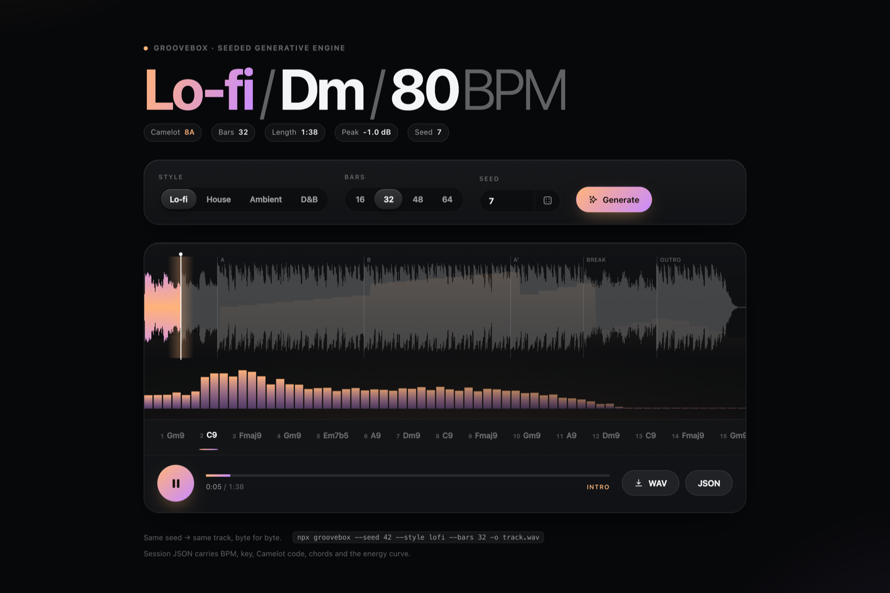
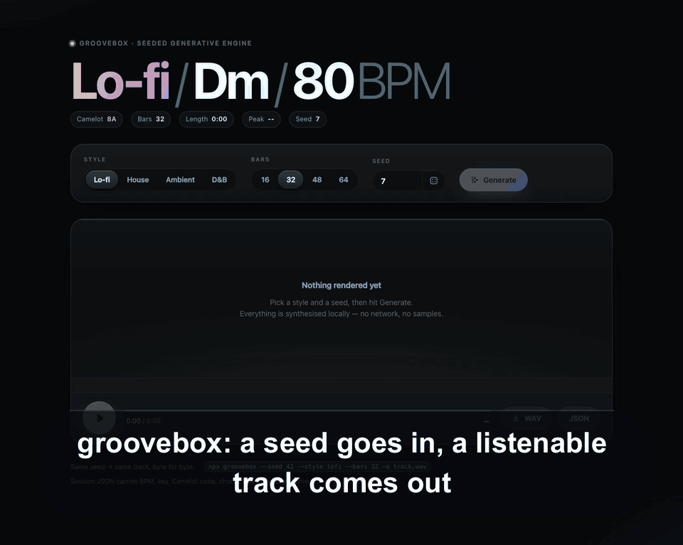

# groovebox

**Seeded generative music in pure TypeScript — a number goes in, a listenable track comes out.**

```
npx groovebox --seed 42 --style lofi --bars 32 -o track.wav
```

No samples, no model weights, no network, no runtime dependencies. Every note is decided by music theory and a seeded PRNG; every sample is synthesised by a software synth written from oscillators up. The same seed always produces a byte-identical file.





**Listen without building:** [lofi-7.mp3](examples/lofi-7.mp3) · [house-21.mp3](examples/house-21.mp3) · [ambient-99.mp3](examples/ambient-99.mp3) (rendered by `npm run demo`, session JSON and MIDI sit beside each one).

---

## Why

I built MixPilot, a local-first AI DJ that reads BPM and key off your local audio files and auto-mixes them. It works well. It also has an obvious problem: it needs music to mix.

So groovebox is the other half. It writes original tracks **and** a session JSON that a DJ tool can ingest directly — BPM, key, Camelot code, the chord list, the section map, the energy curve. MixPilot never has to analyse the audio, because the generator already knows the answer.

I generated the songs, then my DJ mixed them.

The other reason: music theory is one of the most satisfying things to write as code. Markov chains over Roman numerals, voice-leading as a minimisation problem, anti-aliased oscillators, a reverb made of four comb filters — all of it is small, testable, and the output is something you can actually listen to.

---

## 60-second quickstart

```bash
git clone https://github.com/neelbarm/groovebox && cd groovebox
npm install          # TypeScript only; the engine itself has zero dependencies
npm run build
npx . --seed 42 --style lofi --bars 32 --midi --json -o track.wav
open track.wav
```

Then the demo and the browser player:

```bash
npm run demo         # three seeded tracks into examples/ + a summary table
npm run web          # http://localhost:4173 -- generate and play in the browser
npm test             # determinism, theory, WAV/MIDI format, level checks
```

---

## Demo

`npm run demo` renders three ~60-second tracks into `examples/` as WAV + MID + JSON (plus an MP3 preview if ffmpeg is on your PATH) and prints:

```
┌─────────┬──────┬────────┬─────────┬─────┬──────┬────────┬──────────┬─────────┐
│ style   │ seed │ key    │ camelot │ bpm │ bars │ length │     peak │     rms │
├─────────┼──────┼────────┼─────────┼─────┼──────┼────────┼──────────┼─────────┤
│ lofi    │    7 │ Dm ≈Am │ 8A      │  80 │   20 │   1:03 │ -1.00 dB │ -9.6 dB │
│ house   │   21 │ Gm ≈Dm │ 7A      │ 123 │   32 │   1:05 │ -1.00 dB │ -8.7 dB │
│ ambient │   99 │ C      │ 8B      │  72 │   20 │   1:12 │ -1.00 dB │ -7.6 dB │
└─────────┴──────┴────────┴─────────┴─────┴──────┴────────┴──────────┴─────────┘
```

(The real table is coloured and carries an energy sparkline per track. `Dm ≈Am`
means a modal key: the tonic is D, the note collection is A minor's, so the
Camelot code is A minor's 8A.)

Those numbers are reproducible: run it on any machine and you get the same tracks.

---

## How it works

Six stages, each its own module, each pure and deterministic.

### 1. Theory (`src/theory.ts`)

Pitch classes, five scales (major, natural minor, dorian, mixolydian, minor pentatonic), a chord vocabulary keyed by Roman numeral with sevenths and ninths, and **Camelot codes**. The Camelot number comes from the parent major's position on the circle of fifths and the letter from the mode's flavour, which is why relative major and minor share a number (C = 8B, Am = 8A). Modal keys map to the wheel position of their note collection — D dorian is 8A, because a DJ mixes on the note set, not the tonic.

### 2. Markov harmony (`src/harmony.ts`)

Chord progressions are a first-order Markov chain over Roman-numeral **functions**, with a hand-tuned transition table per style: lo-fi leans on ii–V–i with borrowed colour chords, house loops two chords with tension, ambient drifts modally, drum & bass stays minor and lands hard on the drop.

A raw chain wanders, so the chain runs in four-chord phrases and the weights of cadence chords are tripled on the last chord of each phrase. That one rule is most of the difference between "chords" and "a progression".

### 3. Voice leading

Each chord is voiced by enumerating its inversions across a couple of octaves and picking the one that **minimises total movement** from the previous voicing (plus a small penalty for drifting out of register). Cheap, and it stops the pad jumping an octave every bar. The test suite asserts the average movement stays under five semitones.

### 4. Motif-based melody (`src/rhythm.ts`)

Random notes that fit the scale sound like random notes. Instead, each track seeds **two or three motifs** — a rhythmic cell plus a contour of scale steps — and then repeats them across the form with deterministic variations (transpose, invert, thin, extend the tail). Notes on strong beats are forced onto chord tones; everything else may use scale or passing tones. That is what makes the line sound like a theme.

Drums are 16th-step patterns per style, then run through swing (off-eighths pushed to ~58% for lo-fi), velocity humanisation, a few milliseconds of timing drift, ghost snares and a fill on the last bar of every 8-bar phrase. Bass locks to chord roots with octave jumps and a passing note into the next chord.

### 5. Structure (`src/structure.ts`)

A proportional template per style — intro / A / B / A' / break / outro for lo-fi, build / drop / breakdown / drop II for house — scaled to whatever bar count you asked for and snapped to a 4-bar grid (2 bars under 24, 1 bar under 12, and clipped so the sections never claim more bars than the track has) so fills always land on a phrase boundary. Each section declares which layers are playing, which is how instruments enter and leave. The per-bar energy curve falls out of the same data.

### 6. Synthesis (`src/synth.ts`, `src/dsp.ts`)

All of it is arithmetic on `Float32Array`s:

- **polyBLEP oscillators** — sine, triangle, square, saw, noise. Naive saws alias into a metallic ring on high notes; polyBLEP applies a two-sample correction around each discontinuity and most of it goes away.
- **Resonant biquad filter** — the RBJ cookbook low-pass/high-pass/band-pass, with coefficients recomputed every 32 samples so an LFO can sweep the cutoff cheaply.
- **Schroeder reverb** — six parallel damped comb filters into three series allpasses, per channel, with the right channel's delay lengths offset so the tail is genuinely stereo.
- **Stereo delay** — cross-fed between channels for a ping-pong tail, set to a dotted eighth (a dotted quarter for ambient).
- **Drum synthesis** — 808-style kick (a sine with a 35 ms pitch envelope from 115 Hz to 44 Hz, plus a click transient), snare (band-passed noise plus two detuned tones), claps (four noise bursts a few milliseconds apart), hats and ride (filtered noise with different decays).
- **Sidechain ducking** — a gain envelope built from the kick times, with a fast attack and a curved release, multiplied into the pad and bass buses. The classic pump, without a compressor.
- **Vinyl bed** — band-passed hiss plus Poisson-spaced crackle pops, rolled off above 7 kHz. One cheap layer that does most of the work of making a track read as "lo-fi".
- **Master chain** — a 26 Hz high-pass (subsonic energy is wasted headroom), `tanh` saturation, a soft limiter with a peak follower, then normalisation to exactly −1.0 dBFS and a musical fade-out.

### 7. The file writers (`src/wav.ts`, `src/midi.ts`)

Both formats are written by hand, because they are small enough to read in one sitting and the point of this project is that there are no black boxes.

- **WAV** — a 44-byte RIFF header plus interleaved 16-bit PCM.
- **MIDI** — Standard MIDI File format 1: a tempo track plus one track per instrument, variable-length delta times, GM programs, drums on channel 10. Same-key notes are clipped so they always release before retriggering, which is what a sequencer expects.

The test suite includes a small MIDI *reader* purely so it can prove the writer's output parses back.

---

## The MixPilot handoff

Every track can be written with a `--json` sidecar. This is the interface:

```jsonc
{
  "schema": 1,
  "generator": "groovebox@0.1.0",
  "seed": 7,
  "style": "lofi",
  "bpm": 80,
  "key": "Dm",
  "keyName": "D dorian",
  "camelot": "8A",              // harmonic mixing, straight off the wheel
  "camelotKey": "Am",           // the standard key that Camelot code names
  "scale": "dorian",
  "bars": 32,
  "beatsPerBar": 4,
  "durationSec": 98.6,
  "sections": [
    { "name": "intro", "startBar": 0, "bars": 4, "startSec": 0,
      "durationSec": 12, "energy": 0.2, "layers": ["pad", "texture"] }
  ],
  "chords": [
    { "bar": 0, "bars": 1, "startSec": 0, "degree": "iv",
      "name": "Gm9", "notes": [2, 5, 7, 9, 10], "voicing": [55, 57, 58, 62, 65] }
  ],
  "energyCurve": [0.2, 0.24, 0.28, "..."],   // one value per bar, 0..1
  "downbeats": [0, 3, 6, "..."],             // the beat grid, in seconds
  "stats": { "peakDb": -1, "rmsDb": -9.776, "sampleRate": 44100, "frames": 4348260 }
}
```

A DJ tool gets everything it would otherwise have to infer: the tempo is exact rather than estimated, the downbeat grid needs no beat tracking, `camelot` gives harmonic compatibility for free, and `energyCurve` + `sections` say exactly where a mix-in or a drop belongs. `validateSession()` is exported so a consumer can check the schema at the boundary.

---

## Web player

```bash
npm run web   # http://localhost:4173
```

The page imports the compiled engine as native ES modules — no bundler, no CDN, no framework. Generation runs in a module Web Worker (the audio buffers come back by transfer, not copy), Web Audio plays the result, and one `requestAnimationFrame` loop draws a mirrored waveform, a live `AnalyserNode` spectrum with eased decay, the section map, the energy curve and a chord ribbon that tracks the playhead. Colours shift per style; motion respects `prefers-reduced-motion`.

---

## CLI reference

```
groovebox [options]

  --seed <n>          Seed. Same seed + options always yields the same file.  [default: random]
  --style <name>      lofi | house | ambient | dnb                            [default: lofi]
  --bars <n>          Length in bars, 4-512.                                  [default: 32]
  --bpm <n>           Override the tempo the style would pick, 40-220.
  --key <key>         Am, F#m, Bb, C major, D dorian, G mixolydian, ...
  -o, --out <file>    Output WAV path.              [default: groovebox-<style>-<seed>.wav]
  --midi              Also write a standard MIDI file next to the WAV.
  --json              Also write the session JSON.
  --sample-rate <n>   22050 | 32000 | 44100 | 48000                           [default: 44100]
  -q, --quiet         Print only the output path.
  -h, --help          Show help.
  -v, --version       Print the version.
```

Style defaults: lo-fi 70–90 BPM, house 120–126, ambient 62–76, drum & bass 172–176. The seed picks inside the range unless you pin `--bpm`.

### As a library

```ts
import { generate, toWav, toMidi, toSessionJson } from 'groovebox';

const track = generate({ seed: 42, style: 'lofi', bars: 32 });
track.session.camelot;   // "6A"
track.audio.left;        // Float32Array, 44.1 kHz
toWav(track);            // Uint8Array
```

The same module runs unmodified in Node and in the browser.

---

## Scripts

| command | what it does |
| --- | --- |
| `npm run build` | TypeScript (strict) → `dist/` as ESM |
| `npm test` | Builds, then runs the `node:test` suite |
| `npm run demo` | Renders the three example tracks into `examples/` |
| `npm run web` | Static server for the browser player |

`examples/*.wav` is gitignored — the MP3 previews, MIDI and JSON sidecars are committed, because they are small and worth reading. Run `npm run demo` to regenerate the WAVs (and the MP3s, if ffmpeg is on your PATH).

---

## Honest limitations

- It is a **generator**, not a composer. Within a style the tracks are convincing background music; they are not going to surprise you with an idea.
- The lo-fi preset got the most attention and sounds the most finished. Drum & bass is the roughest — the breaks are two-step patterns, not chopped amen loops.
- Ambient is more texture than melody by design; with few notes and long chords, seed-to-seed variety is lower.
- Timbres are synthesised from scratch, so the "Rhodes" is a filtered triangle with detuned saws, not a Rhodes.
- Rendering is single-threaded and roughly real-time-ish: about 3–6 seconds for a 60-second track.

---

## License

MIT © Neel Barmecha. See [LICENSE](LICENSE).

Planned by Claude Fable 5.1, built by a Claude Opus agent in one evening with Claude Code.
